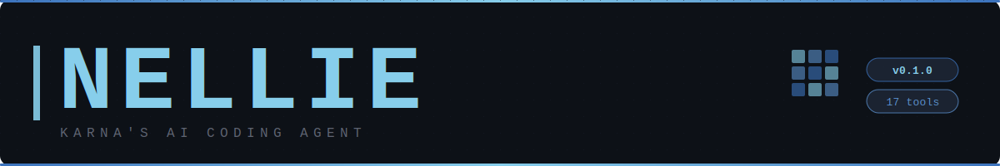
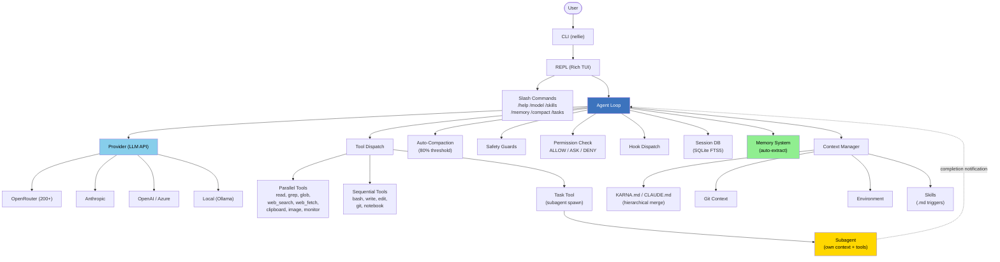
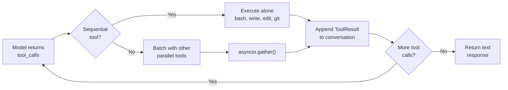
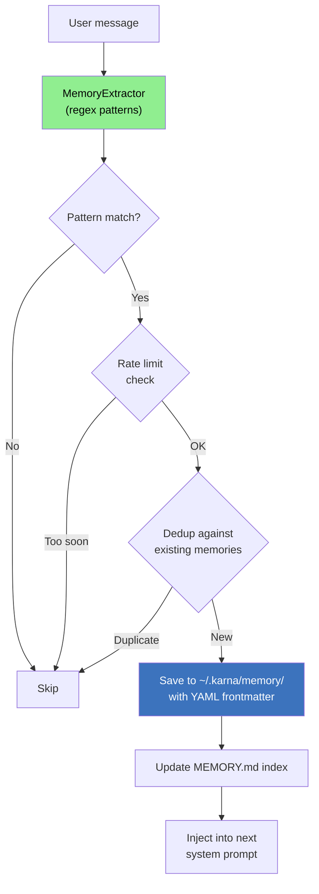
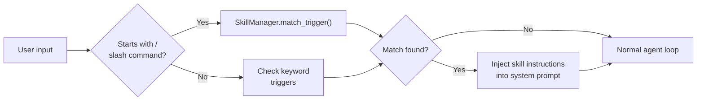
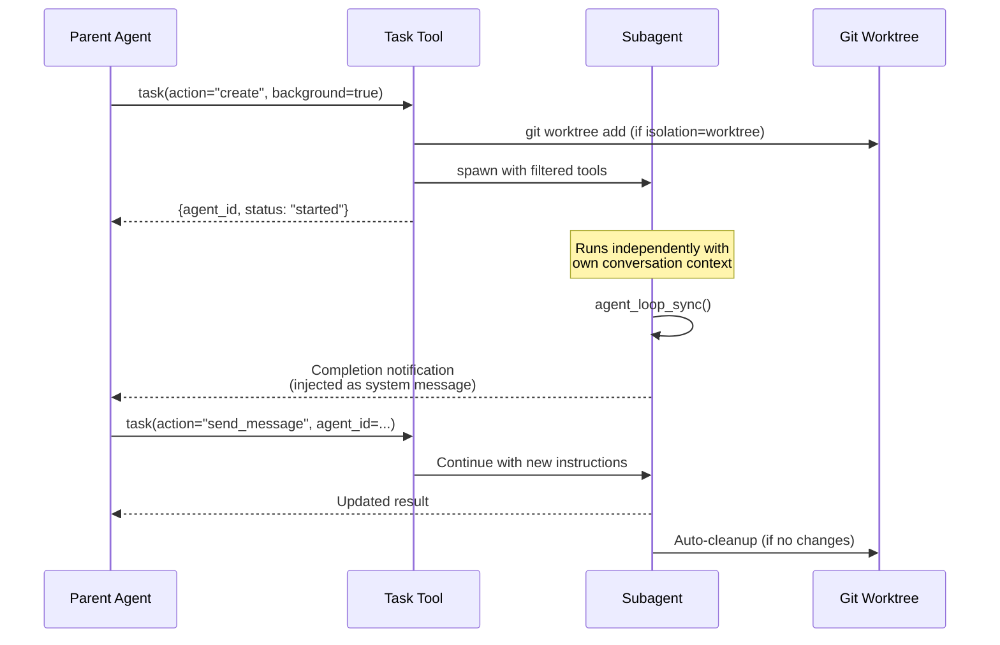

<p align="center">
  
</p>

<p align="center">
  <a href="https://python.org"></a>
  <a href="LICENSE.md"></a>
  
  
</p>

[](https://python.org)
[](LICENSE.md)
[](#tools)

> **Internal Use Only -- Karna Engineering**

Nellie is Karna's AI coding agent. It runs in your terminal, connects to any LLM, reads your codebase, writes code, runs commands, manages git, and learns your preferences across sessions. Runs locally. Costs pennies. Nellie itself sends no telemetry; optional ML features (e.g. `rag`) fetch models from Hugging Face on first use.

**New here? Read [GETTING_STARTED.md](GETTING_STARTED.md) first.**

---

## Install

```bash
git clone https://github.com/Viraj0518/Karna-GenAI-CLI.git
cd Karna-GenAI-CLI
pip install -e .
```

### One-line installers

**Linux / macOS / WSL:**
```bash
curl -fsSL https://raw.githubusercontent.com/Viraj0518/Karna-GenAI-CLI/main/install.sh | bash
```

**Windows** (cmd.exe or Windows Terminal -- NOT Git Bash):
```powershell
iwr https://raw.githubusercontent.com/Viraj0518/Karna-GenAI-CLI/main/install.ps1 | iex
```

Pin a version:
```bash
curl -fsSL https://raw.githubusercontent.com/Viraj0518/Karna-GenAI-CLI/main/install.sh | bash -s -- --version 0.1.2
```

Isolated venv (recommended):
```bash
curl -fsSL https://raw.githubusercontent.com/Viraj0518/Karna-GenAI-CLI/main/install.sh | bash -s -- --venv ~/.nellie-venv
```

Flags: `--version X.Y.Z`, `--force`, `--venv <path>` (sh only), `--dry-run`, `--help`.

## Configure

```bash
# Get a free API key at openrouter.ai -- gives you 200+ models
export OPENROUTER_API_KEY="sk-or-v1-..."

# Set the best free coding model
nellie model set openrouter:qwen/qwen3-coder
```

## Run

```bash
cd your-project/
nellie
```

---

## Why Nellie?

| Capability | Details |
|---|---|
| **Any model** | OpenRouter (200+ models), Anthropic, OpenAI, Azure OpenAI, Google Vertex AI, AWS Bedrock, local/Ollama, multi-credential failover |
| **20 tools** | bash, read, write, edit, grep, glob, git, web_search, web_fetch, clipboard, image, notebook, monitor, task, mcp, browser, db, comms, document, voice |
| **Parallel tool execution** | Independent reads/greps run concurrently; writes are serialized for safety |
| **Skills system** | Extend with `.md` skill files -- custom workflows triggered by slash commands or keywords, enable/disable on the fly |
| **Auto-memory** | Learns your preferences, project facts, and corrections automatically via pattern detection -- persists across sessions |
| **Auto-compaction** | Context auto-compacts at 80% of window; circuit breaker after 3 failures; `/compact` for manual trigger |
| **Subagents** | Spawn background agents with their own context, tools, and optional git worktree isolation; completion notifications delivered to parent |
| **Monitor & background tasks** | Stream events from background processes; bash `run_in_background` mode; unified task management |
| **Project instructions** | `KARNA.md` / `CLAUDE.md` / `.cursorrules` loaded hierarchically -- team-wide conventions enforced automatically |
| **Session persistence** | SQLite-backed with full-text search, resume any past conversation |
| **Cost tracking** | Per-session and cumulative, with budget alerts |
| **Hooks** | Pre/post tool execution lifecycle events |
| **3-tier permissions** | ALLOW/ASK/DENY per tool with pattern matching |
| **Security** | Path traversal guard, SSRF protection, secret scrubbing, dangerous command detection |
| **Credential pooling** | Multi-key rotation for high-volume usage |
| **Prompt caching** | Anthropic cache_control headers (10% cost on cache hits) |
| **Zero telemetry** | No telemetry calls from Nellie itself. Optional ML features (`rag` with `sentence-transformers`) download models from Hugging Face on first use — a one-time fetch, not ongoing telemetry. |

---

## What's new on `dev` (unreleased)

The `dev` branch adds four subsystems that land together in the next cut:

- **RAG** (`karna/rag/`) — local-first retrieval over indexed project files. Uses `sentence-transformers` embeddings (downloaded once on first use) plus a small on-disk vector store. Enables context-aware recall without sending project content to any external service.
- **Multi-agent comms** (`karna/comms/` + `comms` tool) — inter-agent inbox that lets two Nellie instances on the same machine (or a human + an agent) exchange messages by writing markdown files under `~/.karna/comms/inbox/<agent>/`. Reads, sends, and replies are exposed as a tool so the agent can use it the way it uses any other tool.
- **Cron scheduler** (`karna/cron/`) — background scheduler for time-triggered or interval-triggered tasks. Runs inside the agent process; survives session restarts via SQLite-backed state.
- **Persona templates** (`templates/KARNA-*.md`) — five ready-to-copy `KARNA.md` files for different Karna divisions (BD, data-science, engineering, health-comms, research). Drop into a project directory to seed context for the agent; see the Templates section below.

New tools on `dev`: `browser` (Playwright-driven), `db` (SQLite/Postgres/MySQL with read-only default + parameterised bind), `comms` (see above), `document` (PDF/Office/CSV extraction), plus a `voice` experiment.

## Templates

Five persona starter files live under `templates/` and are meant to be copied — **not** invoked via `nellie init` — since each one encodes division-specific context that isn't auto-detectable from the project tree:

| File | Use when |
|---|---|
| `templates/KARNA.md` | Generic base — start here if none of the specialised personas fit |
| `templates/KARNA-bd.md` | Business-development work (contracts, capture, past-performance narrative) |
| `templates/KARNA-data-science.md` | Statistics, modelling, NHANES/NCHS pipelines |
| `templates/KARNA-engineering.md` | Platform / internal tools / infra work |
| `templates/KARNA-health-comms.md` | Public-health communications and risk messaging |
| `templates/KARNA-research.md` | Research design, lit review, protocol authoring |

Usage: `cp templates/KARNA-<persona>.md <your-project>/KARNA.md` — then edit the copy. Nellie picks up `KARNA.md` hierarchically from the project directory.

---

## Architecture



### Tool Execution Flow



### Memory System Lifecycle



### Skills Trigger Matching



### Subagent Spawning & Notification



---

## Free Models (Recommended Starting Points)

No credit card needed. Fund $5 on [openrouter.ai](https://openrouter.ai) when ready for premium models.

| Model | Context | Best for | Command |
|---|---|---|---|
| **Qwen3 Coder 480B** | 262K | Best free coding model -- start here | `nellie model set openrouter:qwen/qwen3-coder` |
| **Qwen3 Next 80B** | 262K | General reasoning | `nellie model set openrouter:qwen/qwen3-next-80b` |
| **GPT-OSS 120B** | 131K | OpenAI's open-weight model | `nellie model set openrouter:openai/gpt-oss-120b` |
| **Nemotron-3 Super 120B** | 262K | NVIDIA, great for large files | `nellie model set openrouter:nvidia/nemotron-3-super-120b` |
| **DeepSeek R1** | 164K | Deep reasoning | `nellie model set openrouter:deepseek/deepseek-r1:free` |
| **Gemma 4 27B** | 262K | Google, supports images | `nellie model set openrouter:google/gemma-4-27b-it:free` |
| **Llama 3.3 70B** | 66K | Proven GPT-4-level workhorse | `nellie model set openrouter:meta-llama/llama-3.3-70b-instruct` |

---

## Commands

```bash
nellie                    # Start the interactive REPL
nellie init               # Initialize project (creates KARNA.md)
nellie init --minimal     # Minimal starter KARNA.md template
nellie model set <model>  # Set active model
nellie config show        # Show configuration
nellie cost               # Show spend summary
nellie history search <q> # Search past sessions
nellie resume             # Resume last session
nellie auth login <prov>  # Configure provider credentials
nellie mcp add <name>     # Add an MCP server
nellie --version          # Show version
```

### Slash commands (inside REPL)

| Command | Description |
|---|---|
| `/help` | Show all commands |
| `/model <provider:model>` | Switch model mid-conversation |
| `/cost` | Show token usage and cost |
| `/compact` | Summarize older messages to free context space |
| `/history` | Show conversation so far |
| `/sessions` | List recent sessions |
| `/resume <id>` | Resume a previous session |
| `/tools` | List available tools |
| `/skills [enable\|disable <name>]` | List, enable, or disable skills |
| `/memory [search\|show\|forget]` | View, search, or manage memories |
| `/loop <goal>` | Repeat-until-done autonomous agent |
| `/plan <goal>` | Think first, read-only plan mode |
| `/do` | Execute the last plan from `/plan` |
| `/system <prompt>` | Set the system prompt |
| `/copy` | Copy last response to clipboard |
| `/paste` | Paste clipboard into prompt |
| `/clear` | Fresh conversation, same session |
| `/exit` | End session |

---

## For Teams: KARNA.md

`KARNA.md` is Nellie's project instruction file. Place it in your repo root to enforce team conventions, define boundaries, and customize agent behavior for everyone on the project.

```bash
cd your-project/
nellie init           # Auto-detects stack and generates a starter
nellie init --minimal # Or start from a minimal template
```

### How it works

```
KARNA.md hierarchy (highest priority first):
1. {project_root}/KARNA.md        -- project-level, checked into git
2. {project_root}/.karna/KARNA.md -- alternate location
3. ~/.karna/KARNA.md              -- global default (your personal prefs)

Compatibility files (lower priority):
4. CLAUDE.md                      -- Claude Code projects
5. .cursorrules                   -- Cursor projects
6. .github/copilot-instructions.md
```

Project-level instructions override global ones. All matching files are loaded and merged, so a project with both `KARNA.md` and `CLAUDE.md` gets both injected (KARNA.md takes priority).

### Example KARNA.md

```markdown
# KARNA.md

## Stack
Python 3.11, Polars, DuckDB, FastAPI

## Conventions
- Use polars over pandas for new code
- SQL queries in queries/ as .sql files
- Tests mirror source structure
- All API endpoints need OpenAPI docstrings

## Don't touch
- config/prod/ (production secrets)
- migrations/ (use alembic)

## Agent defaults
- Always run tests after code changes
- Commit messages: conventional commits format
```

---

## Project Setup

```bash
cd your-project/
nellie init
```

Creates `KARNA.md` -- edit it to teach Nellie your project's stack, conventions, and boundaries. See the [For Teams](#for-teams-karnamd) section above.

---

## Architecture (directory)

```
karna/                            ~22K lines, 105 .py files
├── cli.py                        -- Entry point, 14 commands + 6 sub-groups
├── config.py                     -- KarnaConfig (TOML-backed)
├── models.py                     -- Message, ToolCall, Conversation, Usage
├── init.py                       -- Project init: detect type, generate KARNA.md
├── agents/
│   ├── loop.py                   -- Agent loop (streaming + sync, parallel tool dispatch)
│   ├── subagent.py               -- SubAgent spawning, SendMessage, completion callbacks
│   ├── safety.py                 -- Pre-tool-use safety checks
│   ├── autonomous.py             -- /loop repeat-until-done mode
│   ├── parallel.py               -- Parallel execution coordination
│   └── plan.py                   -- /plan read-only reasoning mode
├── providers/
│   ├── openrouter.py             -- OpenRouter (200+ models, streaming SSE)
│   ├── anthropic.py              -- Anthropic (prompt caching, cache_control)
│   ├── openai.py                 -- OpenAI / Azure
│   ├── local.py                  -- Local endpoints (Ollama, vLLM, etc.)
│   └── caching.py                -- Prompt cache helper
├── tools/                        -- 20 tools (bash, read, write, edit, grep, glob,
│                                    git, web_search, web_fetch, clipboard, image,
│                                    notebook, monitor, task, mcp, browser, db,
│                                    comms, document, voice)
├── auth/                         -- Credential store + multi-key pool rotation
├── context/
│   ├── manager.py                -- Central context manager, token-budget truncation
│   ├── project.py                -- KARNA.md/CLAUDE.md/.cursorrules hierarchical detection
│   ├── git.py                    -- Git awareness (branch, status, commits)
│   └── environment.py            -- Platform, shell, cwd, date
├── prompts/                      -- System prompt builder + per-model adaptations
├── sessions/                     -- SQLite FTS5 persistence + cost tracking
├── memory/
│   ├── manager.py                -- CRUD, search, MEMORY.md index, context injection
│   ├── extractor.py              -- Auto-extraction via regex pattern matching
│   ├── types.py                  -- 4-type taxonomy (user/feedback/project/reference)
│   └── prompts.py                -- Memory system prompt instructions
├── skills/                       -- .md skill files, SkillManager (load/match/enable/disable)
├── hooks/                        -- Lifecycle events (PreToolUse, PostToolUse, etc.)
├── permissions/                  -- 3-tier ALLOW/ASK/DENY per tool
├── compaction/
│   ├── compactor.py              -- Auto-compact at 80% window, circuit breaker
│   └── prompts.py                -- Summarization templates
├── tokens/                       -- Token counting (tiktoken or fallback)
├── security/                     -- Path traversal, SSRF, secret scrub, dangerous cmd
└── tui/                          -- Rich REPL, streaming, 18 slash commands
```

---

## Documentation

| Doc | What |
|---|---|
| [GETTING_STARTED.md](GETTING_STARTED.md) | **Start here** -- setup, models, best practices for the analytics team |
| [docs/DEVELOPER_GUIDE.md](docs/DEVELOPER_GUIDE.md) | Full architecture walkthrough, module reference, extension guide |
| [docs/CODEBASE_MAP.md](docs/CODEBASE_MAP.md) | One-liner per file (105 files) |
| [docs/DIFF_AUDIT.md](docs/DIFF_AUDIT.md) | Competitive comparison vs Claude Code, Cursor, etc. |

---

## Tests

```bash
pip install -e ".[dev]"
pytest tests/ -q
```

---

## License

**Proprietary -- Karna Internal Use Only.** See [LICENSE.md](LICENSE.md) for usage terms. This project may only be used by Viraj and by organizations explicitly authorized in writing. Third-party attributions (MIT-licensed portions from Hermes Agent and OpenClaw) are in [NOTICES.md](NOTICES.md).
