# TUI Visual Audit

> Generated: 2026-04-20 | Branch: `dev` | Nellie v0.1.0
>
> 20 scenarios exercising every TUI rendering feature. Each screenshot is an SVG
> captured via Rich `Console(record=True)` with the Karna blue theme applied.

---

## 1. Banner

Startup banner with ASCII art NELLIE in Karna blue gradient, version, status, model info, and workspace detection.

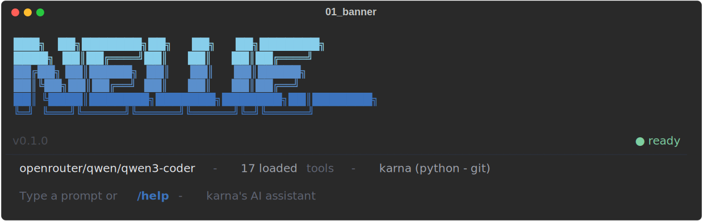

---

## 2. Simple Text Response

Basic text streaming — words arrive as deltas and render inline.

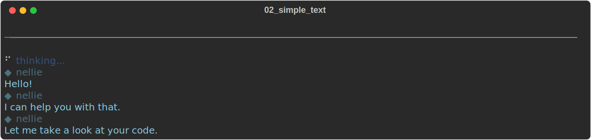

---

## 3. Thinking / Reasoning Stream

Live thinking block in italic purple. Shows the reasoning header followed by streamed thinking content, then transitions to normal assistant text.

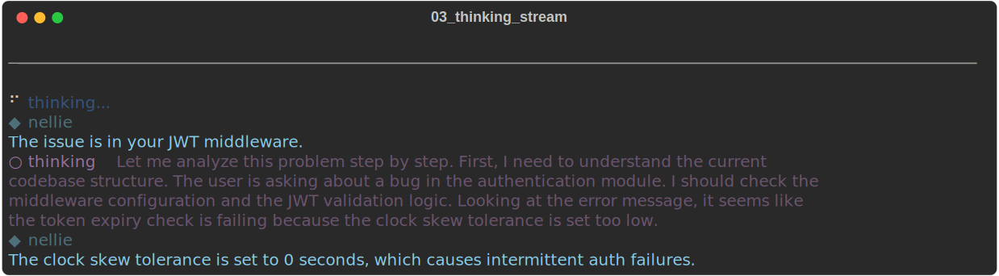

---

## 4. Tool: Bash

Bash/terminal tool call with command preview, spinner, and result output.

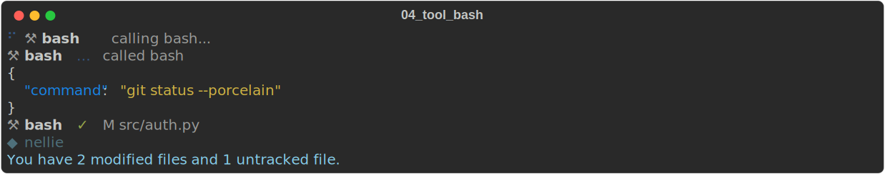

---

## 5. Tool: Read

File read tool call showing file path and content in a bordered panel.

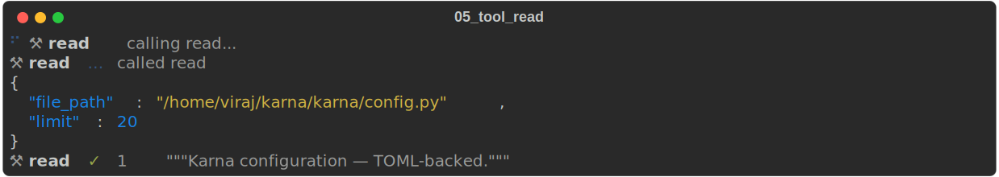

---

## 6. Tool: Edit

Edit/patch tool call showing old_string/new_string args and success confirmation.

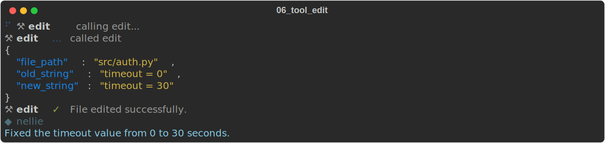

---

## 7. Tool: Grep

Search/grep tool call with pattern and matching results.

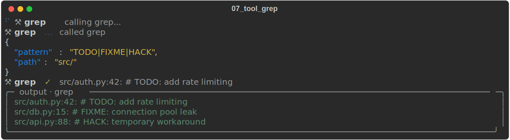

---

## 8. Tool: Web Search

Web search tool call with query and result listing.

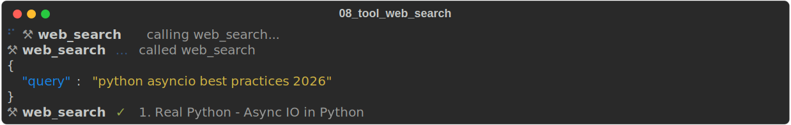

---

## 9. Tool Error

Failed tool call — shows error indicator and recovery text from the model.

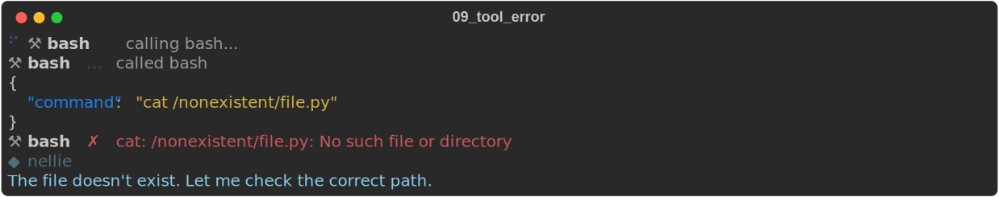

---

## 10. Multiple Tools in Sequence

Three tool calls in sequence (glob → read → edit) showing the full tool lifecycle.

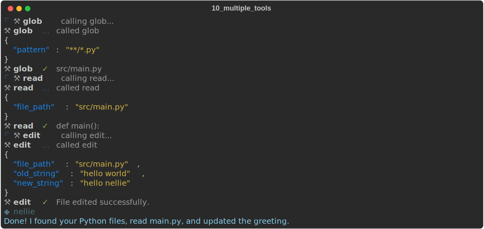

---

## 11. Markdown Response

Rich markdown rendering — headers, numbered lists, code blocks with syntax highlighting, bold text.

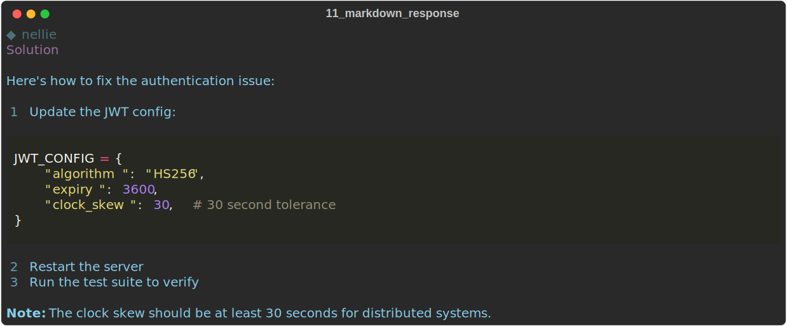

---

## 12. Tool: Git

Git operations tool call showing log output.

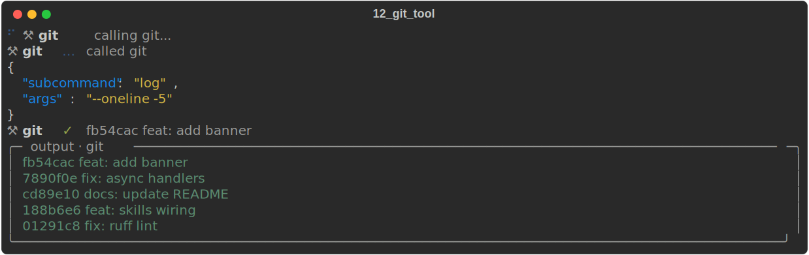

---

## 13. Tool: Write

Write/create file tool call with file path and success message.

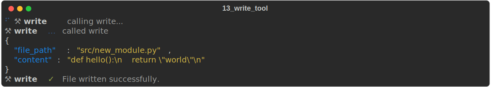

---

## 14. Error Response

Provider error event rendering (e.g., 429 rate limit).

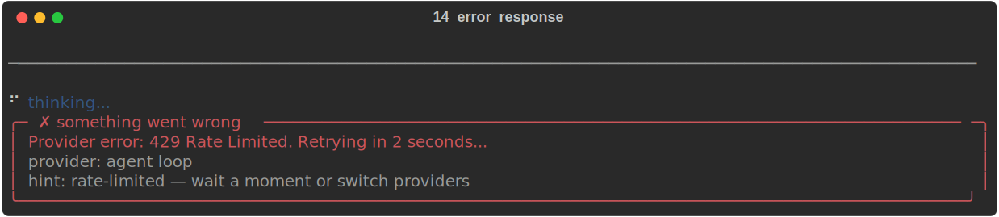

---

## 15. Extended Thinking

Long thinking block (>200 chars) with character count summary after transition to text.

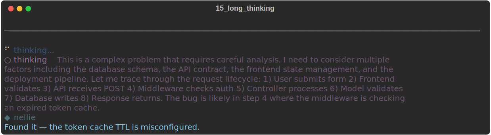

---

## 16. Usage / Cost Display

Token usage and cost rendering after a response.


---

## 17. Tool: Monitor

Background monitor/process tool call with event subscription.

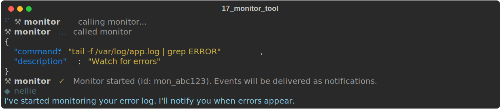

---

## 18. Tool: Subagent / Task

Background subagent spawning with task ID and status.

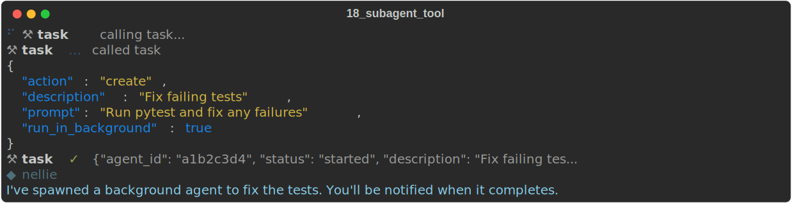

---

## 19. Tool: MCP (External)

MCP tool call (Puppeteer browser navigate) with external tool prefix.

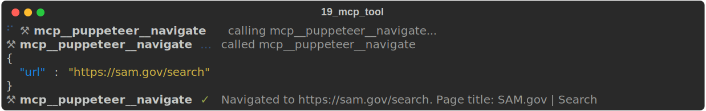

---

## 20. Full Conversation

Complete multi-turn interaction: banner → user prompt → thinking → read tool → edit tool → response with cost. Exercises every rendering path in a single flow.

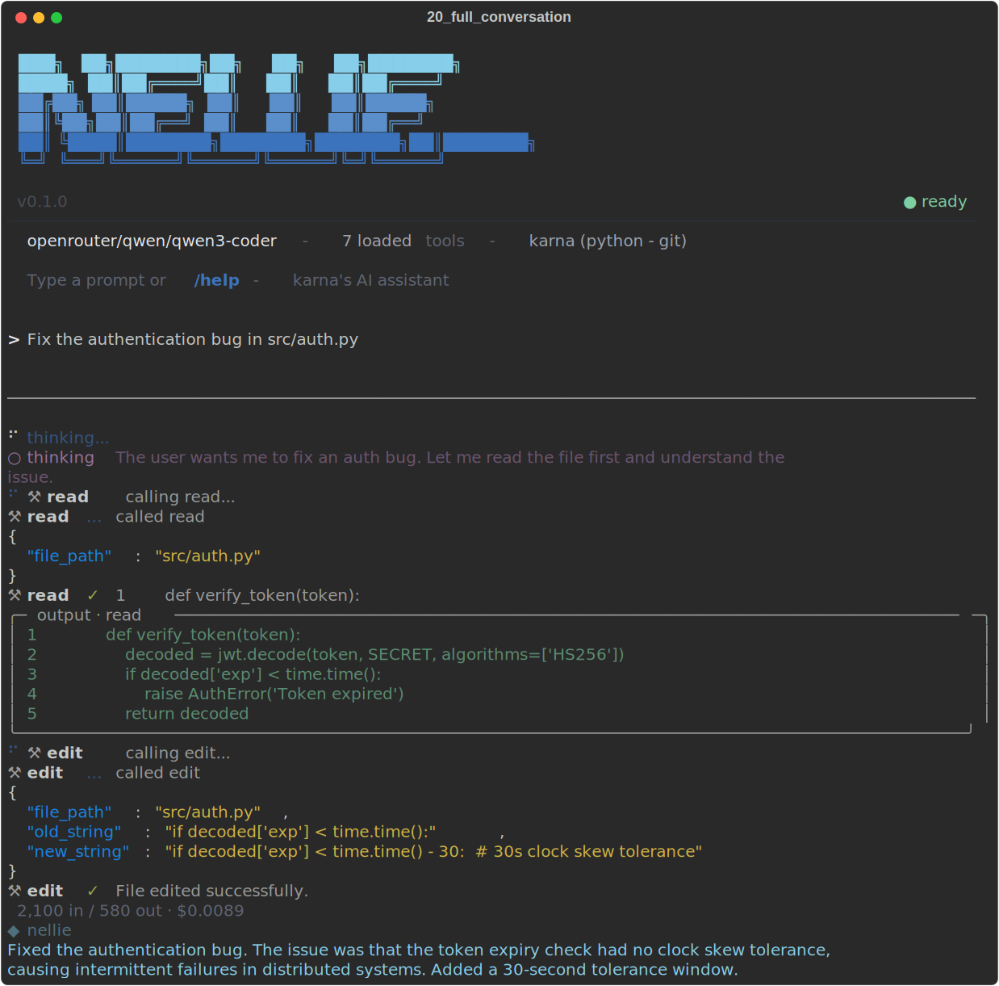

---

## Color Palette

| Token | Hex | Usage |
|-------|-----|-------|
| Brand | `#3C73BD` | Slash commands, accents |
| Hover | `#5A8FCC` | Mid-gradient, secondary |
| Cyan | `#87CEEB` | Assistant text, banner top |
| Success | `#7DCFA1` | Ready indicator, tool ✓ |
| Warning | `#E8C26B` | Caution states |
| Danger | `#E87C7C` | Errors, failures |
| Thinking | `#9F7AEA` | Reasoning blocks |
| Primary text | `#E6E8EC` | User input, model name |
| Secondary text | `#A0A4AD` | Tool counts, workspace |
| Tertiary text | `#5F6472` | Hints, dimmed content |
| Divider | `#2A2F38` | Horizontal rules |
| Background | `#0D1117` | Terminal background |

## Test Harness

The test script lives at `tests/tui_visual_test.py`. Run it to regenerate:

```bash
python3 tests/tui_visual_test.py
# SVGs saved to ~/.karna/tui-screenshots/
```

Each scenario creates a `Console(record=True)` instance, feeds mock `StreamEvent` objects through `OutputRenderer`, and exports the result as SVG.
